  

## Hello World 

### About Me

I’m a software engineer focused on building accessible, polished user interfaces. I take pride in being thoughtful and meticulous, with a sharp eye for the small details that make software feel considered.

A lot of my strength is in piecing together the real user story from requirements, stakeholder context, and rough edges, then turning that into something clearer and more useful than what was first imagined.

Currently, I work at AudioEye, where I maintain and build internal websites and apps across marketing flows, forms, headless CMS integrations, sales quoting software, and the infrastructure around those systems. I also help manage pull requests, own new project work, and keep the apps moving in the right direction.

I’ve worked across in-office, hybrid, and fully remote teams, from a larger company like Clearlink to a small startup like Calldrip. That experience has ranged from end-to-end product work with CRUD applications and databases to the marketing and sales software that helps generate leads and enables teams to sell the product.

Outside of work, you can usually find me with my wife and kids, playing golf, or watching good sports.

### Skills

  
  
  
  
  
  
  
  
  
  
  
  
  
  
  

